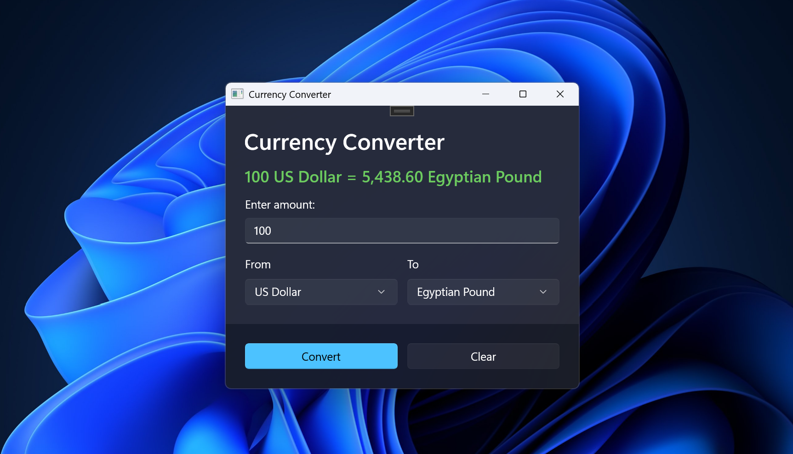

## Currency Converter

A simple static currency converter desktop app built using WinUI 3.
It allows converting amounts between multiple currencies with a clean, minimal interface.

### Features

- Convert between multiple currencies (USD, EUR, GBP, JPY, etc.)
- Input validation for amount
- Error messages for invalid inputs
- Reset/Clear all fields
- Simple and responsive UI

### Screenshot

### Usage

- Enter the amount in the Amount textbox.
- Select From currency and To currency.
- Click Convert to see the converted result.
- Click Clear to reset all fields.

## Technologies Used

- C#
- WinUI 3 (.NET 10)
- XAML for UI

## Notes

- This is a static converter: currency rates are hardcoded.
- For live rates, integration with a currency API (like ExchangeRate API) would be needed.
